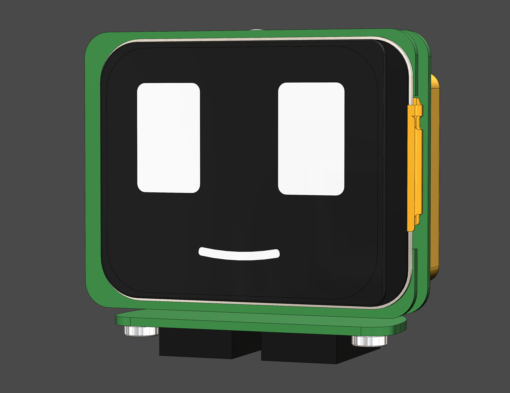
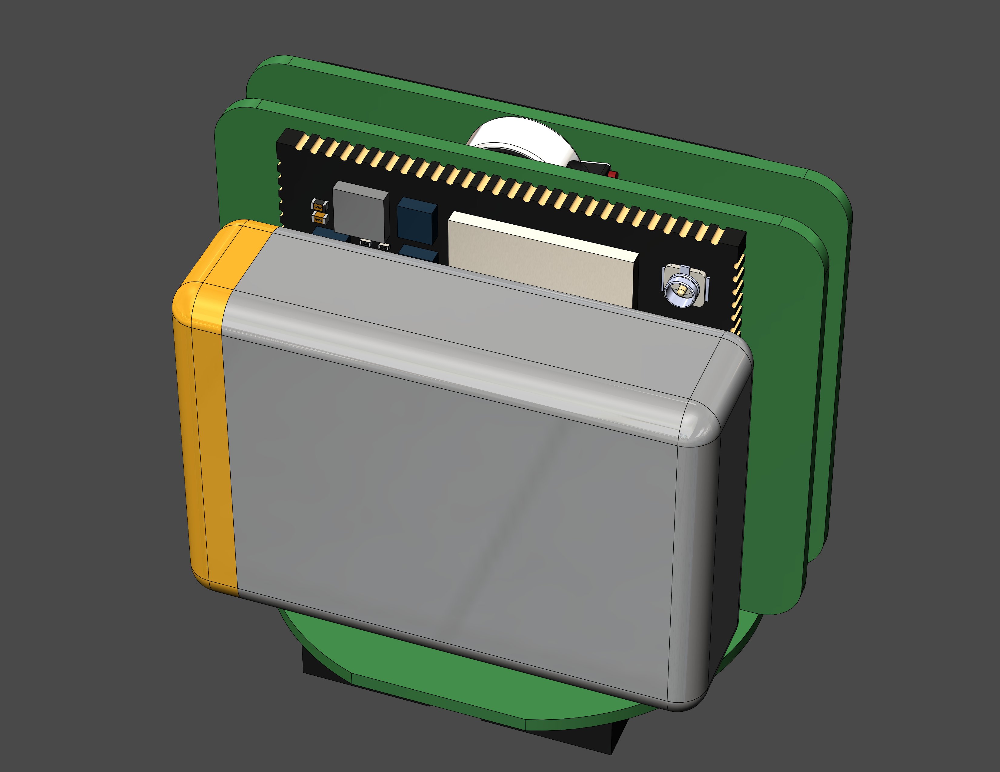
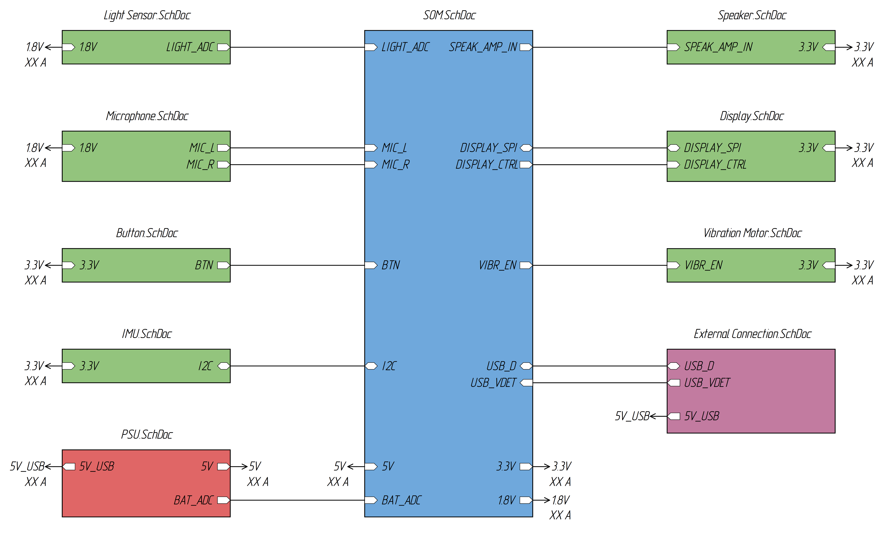
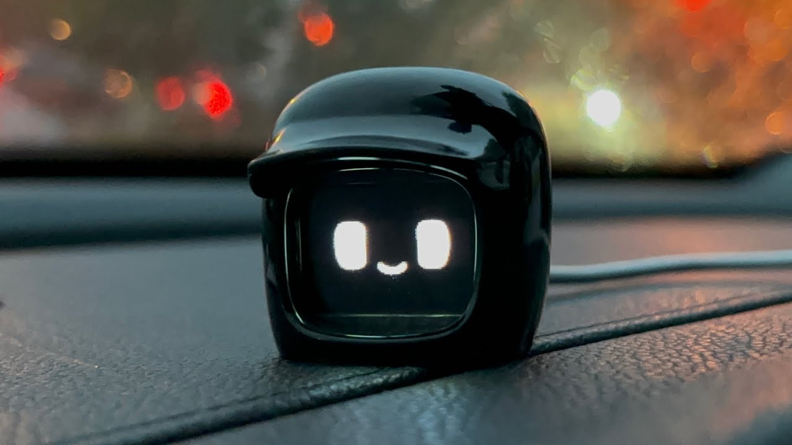

# DENGAO-0.0

First prototype.
A kind of toy, possessing a set of senses and communication methods, as well as assistants, like cloud ones, but fully working offline.
Can be used as a companion on the road, hiking, at work or at home.

Inspired by [DASAI MOCHI](https://dasai.com.au/)

**Software features (release 0.X)**
- Reacting to the environment through:
    - facial expressions,
    - voice,
    - vibration;
- Environmental irritants:
    - sound,
    - acceleration,
    - touch,
    - light;
- An open source audio assistant, fully working on its own processor offline.

Planned for the next release:
- API for user applications;
- Expanding the assistant's functions.

**Hardware features (release 0.X)**

- display;
- speaker;
- microphone set;
- sensor button set;
- light sensor;
- IMU;
- USB 2.0 Type-C;
- Wi-Fi;
- Bluetooth;
- Battery.

Planned for the next release:
- easy changeable outfit for customization;
- Zigbee/Thread fot home and car IoT.

  
  

Current View

  

High-level schematic

  

DASAI MOCHI

